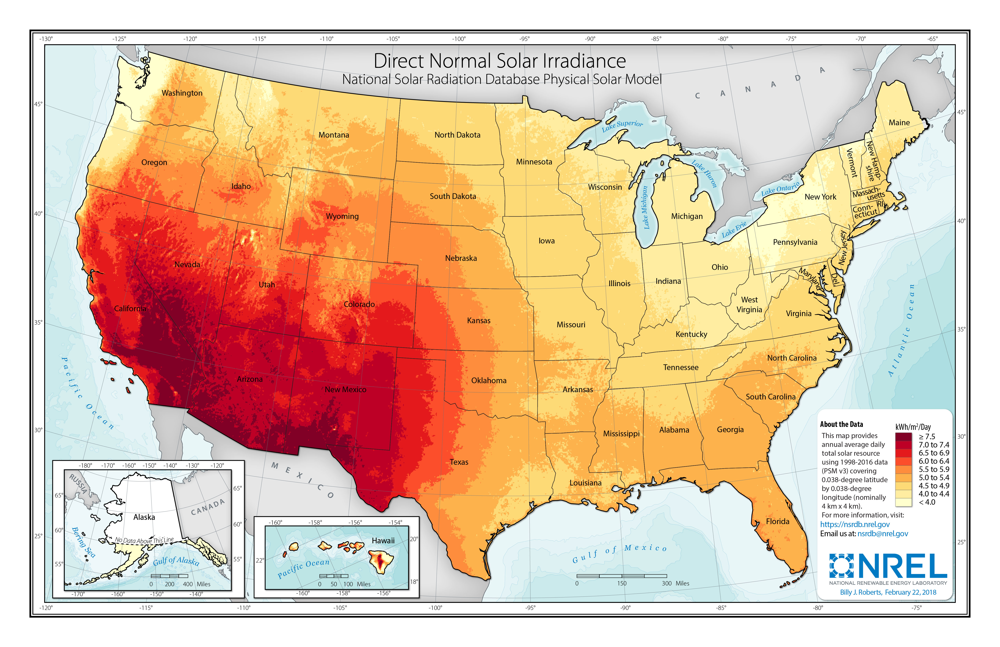
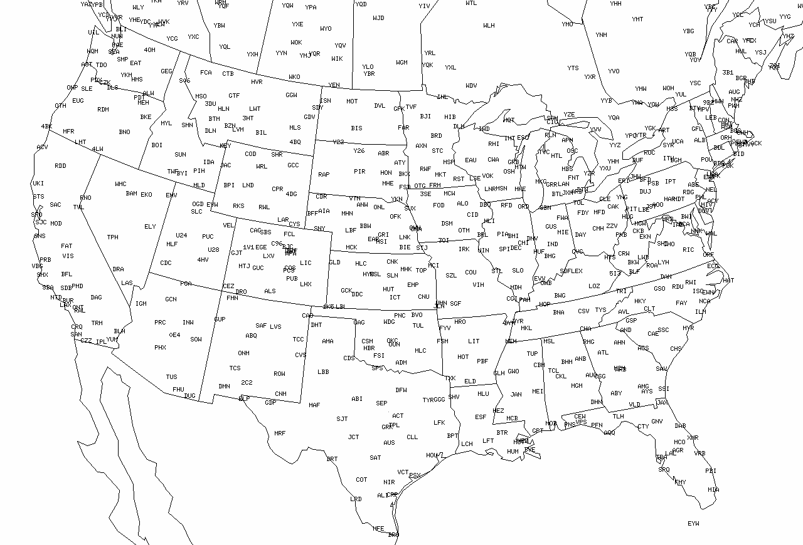

# Data collection and preproccessing
Since we are interested in the adoption of renewable energy by states over time, we collected the following data from 1998 - 2016:
- Geographical:
    + Average Annual Direct Normal Irradiance (DNI)
    + Average Annual Precipitation
    + Average Annual Snowfall
    + Average Annual Temperature
    + Average Annual Windspeed
    + Total State Area
- Economic:
    + Annual Gross Domestic Product (GDP) in units of millions of $USD.
    + Annual Revenue of Electricity Providers
    + Annual Subsidies towards energy providers and products, in units of millions of $USD.
    + Average Electricity Price
    + Prime Supplier of Residual Oil: the supply for heavier oil and is the primary fuel for oil power plants.
- Fossil Fuel Usage and Renewable Energy Production:
    + Total Coal Consumption
    + Total Natural Gas Consumption
    + Hydroelectricity Capacity Potential
    + Hydroelectricity Generation Potential
    + Electricity Generated from Coal
    + Electricity Generated from Biomass
    + Electricity Generated from Geothermal
    + Electricity Generated from Hydroelectricity
    + Electricity Generated from Natural Gas
    + Electricity Generated from Other Renewable Sources
    + Electricity Generated from Other Gases
    + Electricity Generated from Petroleum
    + Electricity Generated from Pump Storage
    + Electricity Generated from Solar
    + Electricity Generated from Wind
    + Electricity Generated from Wood
    + Percentage of Renewable Energy (Derived)

The collected data is organized in the following format:

| State | Year | feature_1 | feature_2 | ... | feature_n |
| ----- | ---- | --------- | --------- | --- | --------- |
| AK    | 1998 | ...       | ...       | ... | ...       |
| ...   | ...  | ...       | ...       | ... | ...       |

It is important to note that the first fifteen features are the features that we think have an impact on the level of renewable energy production, while the remaining features are ground truth labels giving us information on the actual levels of renewable energy production. Hence, we have omitted the ground truth labels in our unsupervised learning portion of our project because we want to identify features that can affect renewable energy production without relying on the actual levels included in the set of features.

## Data collection
While most of our data are readily available on the EIA and some other websites, the DNI and weather data required more work.

### Direct Normal Irradiance (DNI)

While DNI data is available from the National Solar Radiation Database (NSRB) database of the National Renewable Energy Laboratory (NREL), it is in the form of shapefiles where it stored the average DNI of each small area on the entire US. We had to take the mean of the DNI of all of these areas inside a state to arrive at the average DNI in a year for that state. Because the area of these DNI areas are relatively constant, taking a simple mean over them is enough to arrive at an accurate estimation of the state's average DNI.

### Weather
The weather data was processed from National Oceanic and Atmospheric Administration's (NOAA) Global Summary of the Year. This data had the average weather measurements for each individial station in the US. Looking at the map of weather stations in the US (retrieved from Prof. Jon Kahl's [Virtual Weather Map Room](https://sites.uwm.edu/kahl/virtual-weather-map-room/)):

We observe that the stations are relatively spreaded out, therefore, directly taking the average of the average of the stations measurements within a state should give an accurate estimation of the state's average weather measurement.
