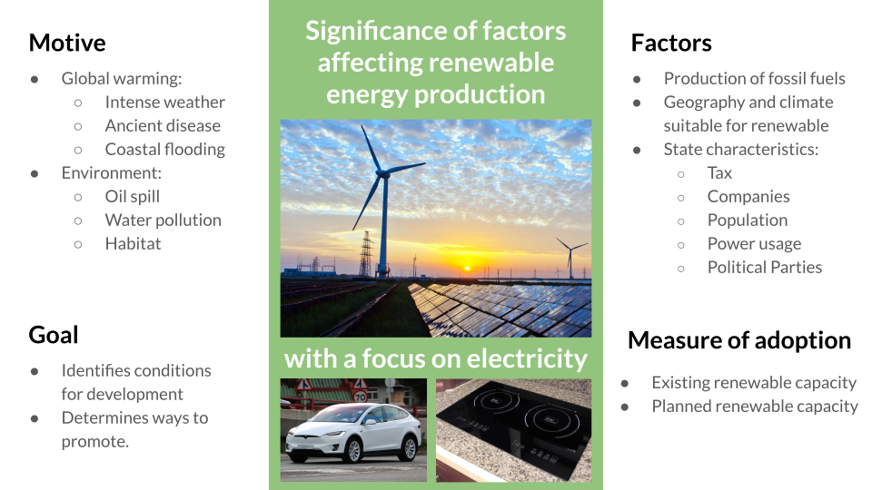

# Introduction

Climate change caused by human emission of greenhouse gas is an ongoing crisis that has and will continue to be a major part of our life.
A warmer ocean will bring more intense storms and hurricane, a warmer arctic has the potential to thaw ancient diseases that had been buried under the snow and the vanishing ice caps will bring coastal floodings which will affect almost all major population centers around the globe.

Even if we disregard the long term effects of global warming, the mining of fossil fuels has ravaged the environment in ways of oil spills, waste water pollution and the shrinking habitats of wildlife.
In addition, the precipitous rate of depletion of our fossil fuel reserves underscores the worrying trend that we are overly reliant on them as a source of energy.
It is clear that we must switch renewable sources of energy sooner rather than later.

[80%](https://www.eia.gov/energyexplained/us-energy-facts/) of the energy used in the US in 2019 was generated from non-renewable sources of energy (coal, petroleum, natural gas and nuclear).
While there has been a positive trend in the production of renewable energy, there are still many questions and reservations toward the development of renewable energy:
- Is renewable energy more expensive compared to fossil fuels?
- To what degree is a favorable geography neccessary for renewable energy production?
- How do we encourage renewable energy production in the most efficient way?

Current applications of machine learning techniques to renewable energy is mostly be limited to local prediction or optimization of renewable energy production and not on answering these important holistic questions which will be of vital importance to policymakers and investors who shapes the development of renewable energy in their local states.

We will attempt to answer these questions using machine learning techniques performed on data from the Energy and Information Administration (EIA) and other sources of geographical, political and economics data.

# Methods

## Data
Data on the production of renewable energy by state and the retail price of electricity ([renewable](https://www.eia.gov/electricity/monthly/epm_table_grapher.php?t=epmt_5_6_a) vs non-renewable) by state will be obtained from the US EIA. In order to identify the factors that might affect the price and adoption of renewable energy in the US, data will be obtained from the following sources:

+ Geographical information from the National Oceanic and Atmospheric Administration:
    - [Average wind direction and speed](https://www.ncdc.noaa.gov/societal-impacts/wind/)
    - [Average solar radiation](https://www.ncdc.noaa.gov/data-access/land-based-station-data/land-based-datasets/solar-radiation) (1991-2010)
    - [Waterway mileage](https://www.statista.com/statistics/187350/us-inland-waterway-mileage-2008/) and [reservoir size](https://waterdata.usgs.gov/nwis/current/?type=lake&group_key=state_cd&site_no_name_select=siteno)
    - [Temperature](https://www.ncdc.noaa.gov/temp-and-precip/us-maps/1/202007) [1]
    - [Precipitation](https://www.ncdc.noaa.gov/temp-and-precip/us-maps/1/202007)
    - [Size of state](https://www.census.gov/geographies/reference-files/2010/geo/state-area.html) [//]: # (has water body data too)

+ Taxes
    - [Oil and gas production](https://www.ncsl.org/research/energy/oil-and-gas-severance-taxes.aspx)

+ Demographic information from the [Census Bureau](https://www.census.gov/quickfacts/fact/table/US/PST045219)
+ [Political affliation](https://www.pewforum.org/religious-landscape-study/compare/party-affiliation/by/state/)

## Unsupervized Learning
We will identify the factors that are the most relevant in our analysis with PCA and use (??) method to analyze how these factors affect the production of renewable energy in the US. Subsequently, we plan to use hyperparameter tuning to optimize the training and performance of our model. 

- K fold cross validation?

## Supervized Learning
- (We could do something like predicting the energy price given certain information?)

# Results 
Once we have completed the necessary tests and analysis, we'll be looking for the factors that have significance in the development of more renewable energy. 

One of the most important results we'll be looking at is the feasibility of producing renewable energy via sources like wind, hydro, and solar. Using PCA for predictive modeling, we should be able to see how much energy should be produced from each of the options and how this might change in the future. We'll also have to consider economic factors, seeing how advances in technology make these options more economically viable compared to the current alternative of oil and gas production. 

Another important set of factors to look at will be how geography affects the realistic production of energies across the country. Obviously areas with a lack of sunlight or bodies of water may have more trouble producing hydro or solar power compared to areas with these natural resources steadily available. With the data we've prepared and analyzed, we should be able to show relevant differences between non-renewable sources of energy with renewable sources. 

# Discussion

best outcome, what it would mean, what is next.....

# References
1. Dumas, A., Andrisani, A., Bonnici, M., Graditi, G., Leanza, G., Madonia, M., &amp; Trancossi, M. (2015). A new correlation between global solar energy radiation and daily temperature variations. Solar Energy, 116, 117-124. doi:10.1016/j.solener.2015.04.002
