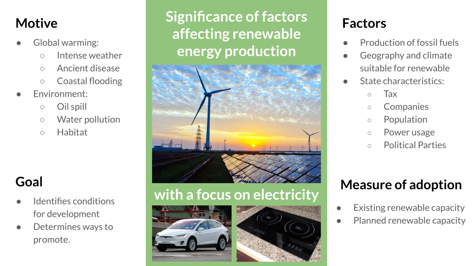

# Introduction

Climate change caused by human emission of greenhouse gas is an ongoing crisis that has and will continue to be a major part of our life.
A warmer ocean will bring more intense storms and hurricane, a warmer arctic has the potential to thaw ancient diseases that had been buried under the snow and the vanishing ice caps will bring coastal floodings which will affect almost all major population centers around the globe.

Even if we disregard the long term effects of global warming, the mining of fossil fuels has ravaged the environment in ways of oil spills, waste water pollution and the shrinking habitats of wildlife.
In addition, the precipitous rate of depletion of our fossil fuel reserves underscores the worrying trend that we are overly reliant on them as a source of energy.
It is clear that we must switch renewable sources of energy sooner rather than later.

[80%](https://www.eia.gov/energyexplained/us-energy-facts/) of the energy used in the US in 2019 was generated from non-renewable sources of energy (coal, petroleum, natural gas and nuclear).
While there has been a positive trend in the production of renewable energy, there are still many questions and reservations toward the development of renewable energy:
- Is renewable energy more expensive compared to fossil fuels?
- To what degree is a favorable geography neccessary for renewable energy production?
- How do we encourage renewable energy production in the most efficient way?

Current applications of machine learning techniques to renewable energy is mostly be limited to local prediction or optimization of renewable energy production and not on answering these important holistic questions. While forecasting wind power [1] or solar power [2] are doubtlessly important, they are not as important as holistic questions to policymakers and investors who shapes the development of renewable energy in their local states. And although studies which answer these questions do exist [3], they do not employ machine learning techniques.

We will attempt to answer these questions using machine learning techniques performed on data from the Energy and Information Administration (EIA) and other sources of geographical, political and economics data.

# Methods

## Data
Data on the production of renewable energy by state and the retail price of electricity ([renewable](https://www.eia.gov/electricity/monthly/epm_table_grapher.php?t=epmt_5_6_a) vs non-renewable) by state will be obtained from the US EIA. In order to identify the factors that might affect the price and adoption of renewable energy in the US, data will be obtained from the following sources:

+ Geographical information from the National Oceanic and Atmospheric Administration:
    - [Average wind direction and speed](https://www.ncdc.noaa.gov/societal-impacts/wind/)
    - [Average solar radiation](https://www.ncdc.noaa.gov/data-access/land-based-station-data/land-based-datasets/solar-radiation) (1991-2010)
    - [Waterway mileage](https://www.statista.com/statistics/187350/us-inland-waterway-mileage-2008/) and [reservoir size](https://waterdata.usgs.gov/nwis/current/?type=lake&group_key=state_cd&site_no_name_select=siteno)
    - [Temperature](https://www.ncdc.noaa.gov/temp-and-precip/us-maps/1/202007) [4]
    - [Precipitation](https://www.ncdc.noaa.gov/temp-and-precip/us-maps/1/202007)
    - [Size of state](https://www.census.gov/geographies/reference-files/2010/geo/state-area.html)

+ Taxes
    - [Oil and gas production](https://www.ncsl.org/research/energy/oil-and-gas-severance-taxes.aspx)

+ Demographic information from the [Census Bureau](https://www.census.gov/quickfacts/fact/table/US/PST045219)

## Unsupervized Learning
We will identify the factors that are the most relevant in our analysis with PCA to analyze how these factors affect the production of renewable energy in the US and use the various clustering methods to classify the state as being successful or unsuccessful in renewable energy production. Subsequently, we plan to use hyperparameter tuning to optimize the training and performance of our model. 

## Supervized Learning
Our project also aims to use either a regression model or neural network to predict the price of electricity in the state given a certain percentage of renewable energy production. 

# Results 
Once we have completed the necessary tests and analysis, we'll be looking for the factors that have significance in the development of more renewable energy. 

The main thing we want to consider is the economic feasibility for a state to increase the percent of its total energy from renewable energy to a higher amount. We would look at how much of the state's energy is currently coming from renewable energy, and how much it would cost for that to be raised by a significant amount such as 10%. This cost would need to factor in the cost of energy in general, the cost of producing oil and gas compared to renewable energy, and how much energy might be self-produced or imported per state. 

We will try and analyze what a realistic increase in renewable energy used would cost per state. Different states will have different factors to consider, such as the amount of non-renewable energy self-produced, geographic location and natural resources, and natural forces such as weather. The current amount of renewable energy being produced today is steadily improving, but still a minority in the total energy consumption. We hope to provide a valuable analysis that can look at the feasibility of increasing renewable energy production from an economic standpoint. We can measure the amount of success based on the predictive analysis clustering states together that have reasonable success in producing renewable energy and using the results to predict how possible it would be to increase production of renewable energy. 

# Discussion

Our goals are twofold: first, we wish to see which factors in a state contribute most significantly to the prevalance of renewable energy in that state. This will be of use to policymakers and perhaps even investors or entrepreneurs who can see what underlying issues or situations must be addressed on the road to a totally green state. Further development in this portion of the project would entail more detailed breakdown of factors in a state, as well as trying different methodology to find these factors.

Our second goal is to develop a model that predicts the energy price in a given state based on a set of factors, the most important of which is the percentage of energy produced by renewable means in that state. Hopefully, we can show that in the long run, energy cost goes down given an increase in renewable energy sources. This will provide a direct economic motivation for green energy.

# References
1. Demolli, H., Dokuz, A. S., Ecemis, A., &amp; Gokcek, M. (2019). Wind power forecasting based on daily wind speed data using machine learning algorithms. Energy Conversion and Management, 198(111823). doi:10.1016/j.enconman.2019.111823

2. Aggarwal, S., &amp; Saini, L. (2014). Solar energy prediction using linear and non-linear regularization models: A study on AMS (American Meteorological Society) 2013–14 Solar Energy Prediction Contest. Energy, 78, 247-256. doi:10.1016/j.energy.2014.10.012

3. Owusu, P. A., &amp; Asumadu-Sarkodie, S. (2016). A review of renewable energy sources, sustainability issues and climate change mitigation. Cogent Engineering, 3(1). doi:10.1080/23311916.2016.1167990

4. Dumas, A., Andrisani, A., Bonnici, M., Graditi, G., Leanza, G., Madonia, M., &amp; Trancossi, M. (2015). A new correlation between global solar energy radiation and daily temperature variations. Solar Energy, 116, 117-124. doi:10.1016/j.solener.2015.04.002
