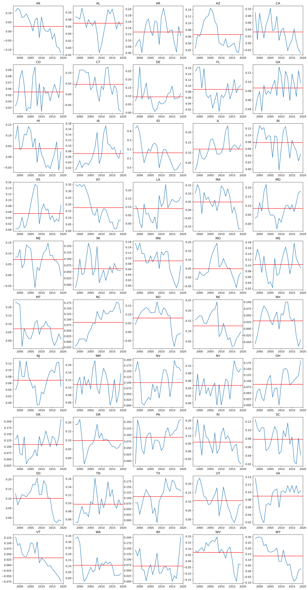

# Supervised learning
After visualizing and attempting to reduce the dimensionality of our data using PCA, we proceeded with the supervised learning section of our project. A key question that we asked ourselves is: are we able to predict the price of electricity in a state accurately using the dataset that we had. Using supervised learning, we aim to create a machine learning model that predicts the price of electricity in a state based off the features that we collected earlier. To guage the accuracy of our model, we calculated the mean squared error for the predictions of our model on the unseen data from 2017 to 2019. 

## Model Architecture
We chose to implement a deep neural network to perform our prediction task. Deciding the model architecture involved a fair amount of trial and error. Initially, our neural network did not train well; the training and validation loss remained high and stagnated after a few epochs. We found that the model did so because we used ReLU as the activation function for the final output layer. When the model predicted an output that was negative, the gradient of the activation function would be zero, which causes the weights in the hidden layers to remain unchanged in the backpropagation step. Replacing the ReLU activation function with a linear one resolved this issue. 

Subsequently, we experimented with the design of our model architecture by varying the number of hidden layers and the number of nodes in each layer using K-Folds cross validation. A fifth of the dataset was used as the validation set and the validation loss of the model was computed after training for 200 epochs. This was repeated with the rest of the dataset with re-initialized weights until each model has been validated with all five folds of the K-Folds split and the other hyperparameters held constant. The average validation loss was then computed and used to compare to that of our other models. The results led us to select our finalized model architecture for subsequent training and fine-tuning of the other hyperparameters. 

Our final model consists of sixteen hidden layers with 128 nodes each with LeakyRELU as our activation function on all layers except for the final one. 

## Training Process
Our model was trained on data from all 50 states from the years 1998 to 2016. As mentioned above, a fifth of the dataset was reserved for the validation set. The years 2017 through 2019 were reserved for final testing and at no point in training did the model see data from these years.

### Hyperparameter Tuning
We experimented with a variety of activation functions, number of hidden layers, width of hidden layers, and even tried to adpot an ensemble model of networks in an effort to improve our final error scores. The ensemble models converged well, however our final model outperformed them on our test data and we abandoned the ensemble method.

### Splitting dataset for training and validation
We use our dataset from the year 1998-2016 as our training set and our dataset from the year 2017-2019 as our validation set. The 1998-2016 dataset was the most accurate since it had no interpolated data while the 2017-2019 was not as accurate since it had interpolated Direct Normal Irradiance data. We simply took the DNI for the year 2016 and repeated it for the year 2017-2019. This probably resulted in a lower DNI than reality because there seems to be an upward trend of DNI growth over the years.

Our reason for splitting it this way is because we will always be training our model on past years to predict future years. By splitting it this way, we simulate what might happen when we use our model to predict the electricity price of the future.

### Loss
Below is the loss graph of our final model, which has the lowest overall error on our ultimate test set (the years 2017-2019). Although some other models we trained converged in a smoother manner, ultimately this model still performs well. We see a convergence of losses and most importantly, an improvement in validation loss.

## Error Analysis
Looking at the mean absolute error of our model's prediction in each year, we can see that our model does not perform significantly worse or significantly better in any of the year, with the mean mean error staying around 9%.

Looking at the mean absolute relative error for each state however, we can recognize some quirks of our model. It consistently predict an average electricity price higher than the ground truth, with the median error around 8%. Also plotted are the confidence interval of the predictions which denotes where 95% of the relative errors are located. We can see that for most of the states the error of our models are fairly similar except for Washington (WA), Wyoming (WY), Idiana (ID) and Kentucky (KY).

Plotted below are the relative error of our predictions for all US states for the years 1998-2019.

## Prediction
Using the neural network we implemented, the goal was to predict accurate electricity prices given the other features. After training on the dataset from 1998-2016, we validated on 2017-2019 to and predicted prices for each state. Observing the results, we can tell that there are some inaccuracies with our predicted prices compared to the given data. The mean squared error value we obtained shows that there is a decent deviation of prices compared to actual values, which indicates that our model has some trouble predicting. However, in the graph of all states below, we can see that our predictions follow the general upward trend of prices. 

Looking at the graphs, we can see that for many of the states we overestimate the predicted price such as for TN, NC, OH and more. However, the predictions tend to follow the general upward trend of the prices even if the price predicted is somewhat off. While attempting to predict the prices, we were aware that there exists multiple factors difficult to account for. Our first and foremost concern was the lack of data for certain features when collecting data. For certain features such as solar radiation, we had to extrapolate recent data for 2017-2019 since data post-2016 was unavailable. We would have preferred data dating back to further than 1998, but that was not readily available for many of the features. There was also the problem that occasionally states withheld or did not provide data for certain features, which we had to supplement with national averages. The second concern was the case of inflation regarding electricity prices. While we used the producer price index to attempt to account for inflation, this method may not have been perfect. Finally, another concern was in regards to environmental policies, governmental policies and other factors that were not directly accounted for by the data. Federal policies and state policies in regards to oil production, transportation costs, and other factors could have influenced changes through the approximate twenty year span. Overall, we attempted to predict average electricity prices to the best of our ability while working around these external factors. 
