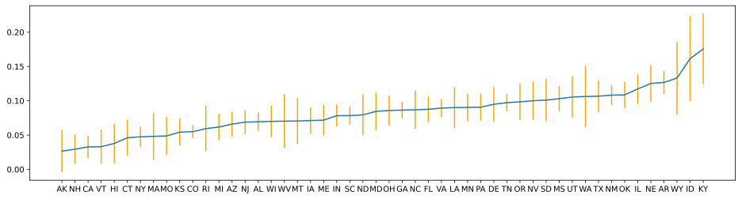

# Supervised learning
After visualizing and attempting to reduce the dimensionality of our data using PCA, we proceeded with the supervised learning section of our project. A key question that we asked ourselves is: are we able to predict the price of electricity in a state accurately using the dataset that we had. Using supervised learning, we aim to create a machine learning model that predicts the price of electricity in a state based off the features that we collected earlier. To guage the accuracy of our model, we calculated the mean squared error for the predictions of our model on the unseen data from 2017 to 2019. 

## Model Architecture
We chose to implement a deep neural network to perform our prediction task. Deciding the model architecture involved a fair amount of trial and error. Initially, our neural network did not train well; the training and validation loss remained high and stagnated after a few epochs. We found that the model did so because we used ReLU as the activation function for the final output layer. When the model predicted an output that was negative, the gradient of the activation function would be zero, which causes the weights in the hidden layers to remain unchanged in the backpropagation step. Replacing the ReLU activation function with a linear one resolved this issue. 

Subsequently, we experimented with the design of our model architecture by varying the number of hidden layers and the number of nodes in each layer using K-Folds cross validation. A fifth of the dataset was used as the validation set and the validation loss of the model was computed after training for 200 epochs. This was repeated with the rest of the dataset with re-initialized weights until each model has been validated with all five folds of the K-Folds split and the other hyperparameters held constant. The average validation loss was then computed and used to compare to that of our other models. The results led us to select our finalized model architecture for subsequent training and fine-tuning of the other hyperparameters. 

Our final model consists of sixteen hidden layers with 128 nodes each. 

## Training Process
### Hyperparameter Tuning
### Splitting dataset for training and validation
### Loss

## Error Analysis

## Prediction
Using the neural network we implemented, the goal was to predict accurate electricity prices given the other features. After training on the dataset from 1998-2016, we validated on 2017-2019 to and predicted prices for each state. Observing the results, we can tell that there are a lot of inaccuracies with our predicted prices compared to the given data. We can see that many of the data points seem to be gross underestimations compared to the recorded prices. The mean squared error value we obtained of 5.89$ shows a large deviation in predictions versus actual prices.

One thing of note is that the predicted prices have weird values in year 2017. From observing the predictions, we can see that predictions in 2018 and 2019 match the actual values much closer than 2017. For some reason, the values in 2017 are severely lower than those of the actual values. There could be a variety of reasons that caused this, and we may not be able to account for factors such as politics. However, there is a possibility that we made an error with inputting data or somewhere else in the process of predicting which we need to further evaluate. 
