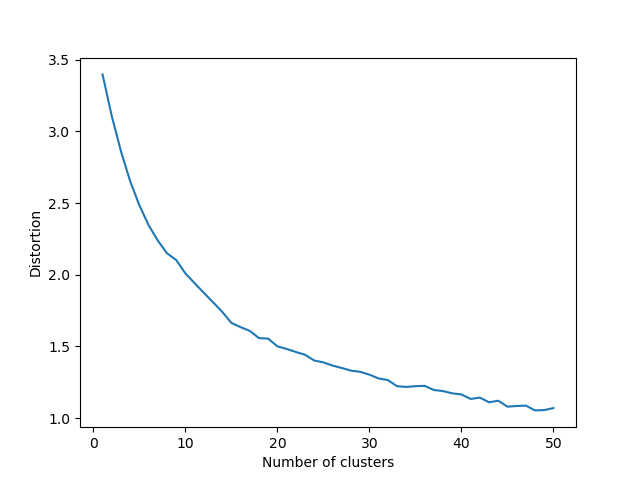
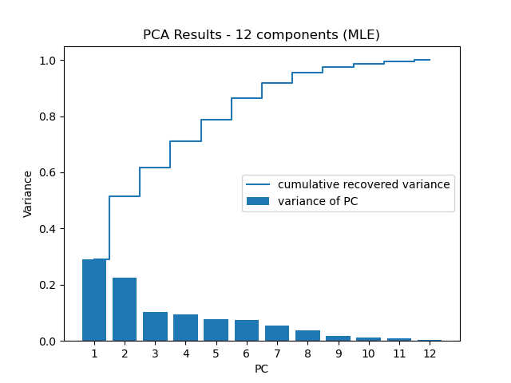
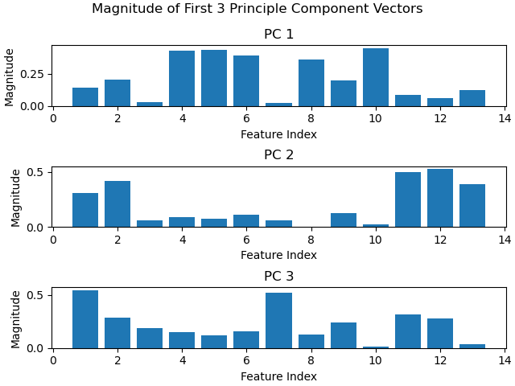

# K-means clustering

Running preliminary k-means on the dataset and analysing the distortion, we get the result:

This graph is fairly smooth which means that there is probably no hard clusters which we can assign the states to. However, we can still pick k = 15 as a good cluster number.

K-means was performed with each point representing a particular state in a particular year (i.e. data for AL in 1998), which corresponds to 19 (years) x 50 (states) = 950 distinct points.

In doing so, we want to see if states with similar percentages of renewable energy adoption are actually similar and if the data of states for different years are similar across the years.

Getting the result of k-means with 15 clusters and then counting the number of times a state appears in a cluster, we have the result:

- Cluster 1: 19 times : TX
- Cluster 2: 19 times: AK
- Cluster 3: 19 times: CA
- Cluster 4: 19 times: NM
- Cluster 5: 19 times: NY
- Cluster 6:
    + 19 times: FL
    + 4 times: LA
- Cluster 7:
    + 12 times: HI
    + 1 time: OH
- Cluster 8:
    + 19 times: AZ, NV
    + 18 times: UT
- Cluster 9:
    + 19 times: OR, WA
    + 18 times: ID 
- Cluster 10:
    + 19 times: MT, WY, CO
    + 1 time: ID
- Cluster 11:
    + 16 times: IL, IN, PA, OH
    + 14 times: MO
    + 12 times: MI
    + 4 times: WV, 
- Cluster 12:
    + 19 times: ME, VT, NH
    + 6 times: CT
    + 5 times: MI
    + 4 times: WV
    + 3 times: WI, MA
    + 2 times: RI
    + 1 time: MN, 
- Cluster 13:
    + 19 times: GA, MS, TN, NC, SC, AR, AL
    + 18 times: KY
    + 15 times: LA
    + 11 times: VA
    + 9 times: WV
    + 2 times: MO, OK
- Cluster 14:
    + 19 times: IA, NE, SD, KS, ND
    + 18 times: MN
    + 17 times: OK
    + 14 times: WI
    + 2 times: MI, MO
    + 1 time: IL, IN, UT
- Cluster 15:
    + 19 times: MD, DE, NJ
    + 17 times: RI
    + 16 times: MA
    + 13 times: CT
    + 8 times: VA
    + 7 times: HI
    + 3 times: PA
    + 2 times: WV, WI, IL, IN, OH
    + 1 time: MO, KY,

# Principal Component Analysis (PCA)

We performed PCA on our data to reduce the number of dimensions of the dataset. The number of components selected is based on the MLE of the data, and the results are as follows:

