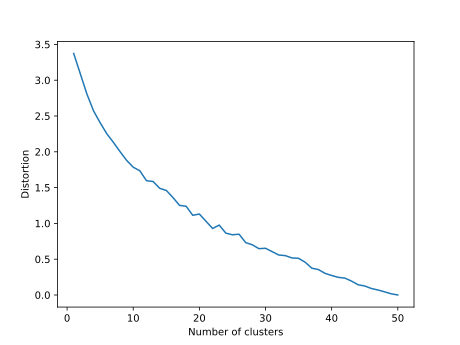
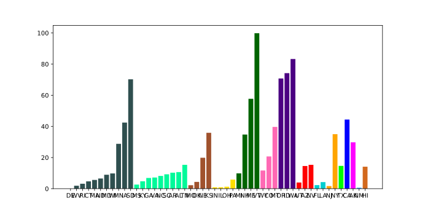
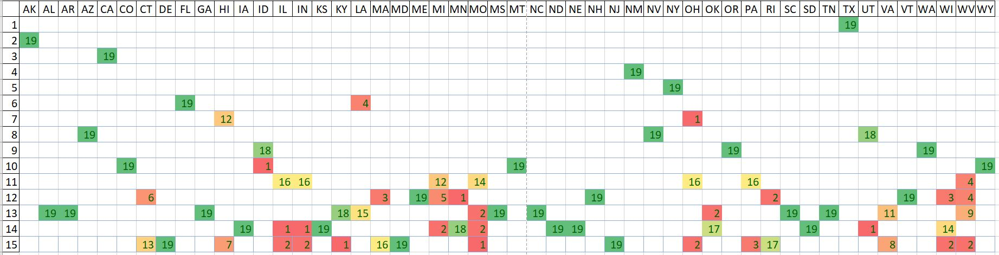
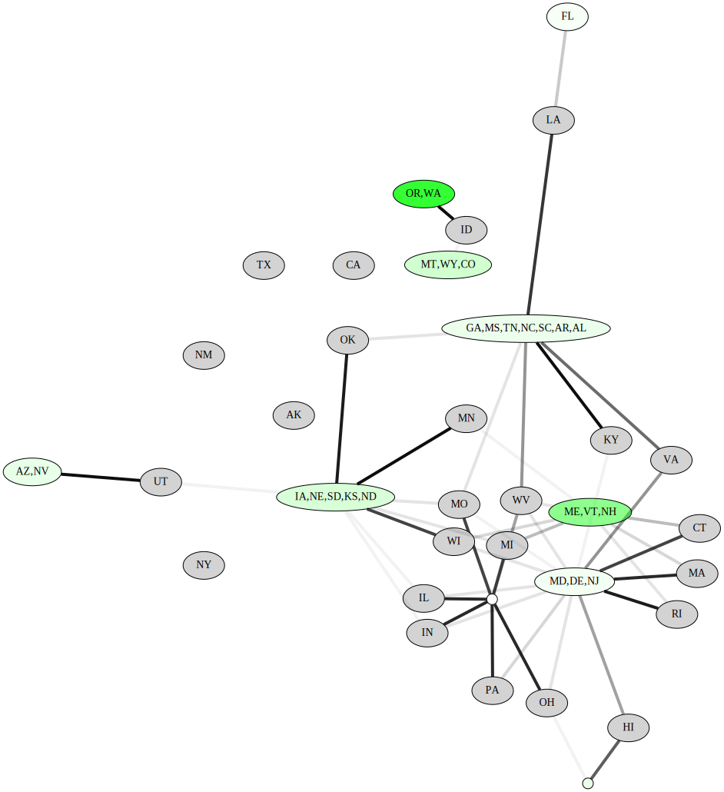
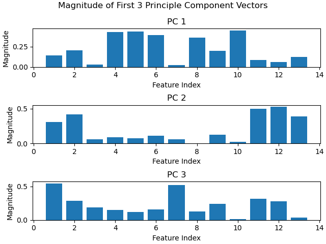

# K-means clustering
## Latest data (2016)
Running preliminary k-means on the most recent data we have (2016) and analysing the distortion, we get the result:

From this graph, we pick k = 15 to cluster the data of the states in 2016 without renewable energy production. We plot the clusters together with the states' renewable energy percentage. States which are in the same cluster have the same color.

We can draw some observations from this graph:
- While there are definite clusters which have similar renewable energy percentage, most clusters have very large variance
in its renewable energy percentage.
- Oregon and Washington are similar both geographically and in their renewable energy percentage.
- Alaska, Hawaii, New Mexico, California and Texas are uniquely in their own clusters.
- New York and New Jersey are in their own cluster.

The variance of renewable energy percentage within some clusters are encouraging because it implies that similar states can have wildly different renewable energy percentage which can be attributed to different policy or development.

## All years (1998-2016)
Running preliminary k-means on the entire range of data we have (1998-2016) and analysing the distortion, we get the result:

We also pick k = 15 to cluster the data which is similar to the clustering we've done on just 2016. This makes sense because the nature of the data hasn't changed, we've just included a wider range of it. However, because of the inclusion of multiple years of the same state, we can no longer represent the clustering as simply as we did for just 2016.

The clustering represented in tabular form with the columns as the clusters and rows as the states:

This visualization shows us the raw clustering and the spread of the states between clusters. For a deeper analysis and easier viewing, we convert it to this graph representation:

States which are always clustered together for all 19 years are put in the same node, with the color of the node representing the mean renewable energy percentage within that cluster. For states which had different years clustered to multiple different clusters, we use the edges' weights to represent how often the state is assigned to that cluster.

We observe the following things:
- A lot of clusterings are simply softer versions of the latest years clustering. For example:
    + Arkansas, Alabama, Georgia, Mississippi, North Carolina, South Calorina, Tennessee are in the same cluster.
    + Alaska, Hawaii, New Mexico, California and Texas are still in their own clusters
    + Oregon and Washington are still isolated in their own cluster.
- However, the softer clustering is encouraging for renewable energy development. The fact that states which are predominantly clustered with low renewable percentage states are also sometimes clustered with high renewable percentage states means that in some years the features of that state where closer to that of high renewable percentage states.

This clustering gives us justification that it is possible to transition a state (change it's features) to achieve a higher renewable energy percentage.

# Principal Component Analysis (PCA)



We performed PCA on our data to reduce the number of dimensions of the dataset. The number of components selected is based on the MLE of the data, and the results are as follows:

We were successful in reducing the dimension of our dataset, to 12. We will be running both K-means clustering and GMM utlizing the PCA components and comparing it with the results for K-means and GMM utilizing the raw dataset. Worth noting is the idea that proper scaling is extremely important for our dataset, as we are taking into account features that commonly that differ by many orders of magnitude. As an example, one feature is measured in hundreds of millions of dollars, while another is a percentage value ranging from 0 to 100. Scaling each feature beforehand is crucial to the PCA having any meaning. Next, we will look at what features are represented in the PCA components to see if any stand out:

As can be seen, there is a fairly decent spread of feature magnitudes among the first few components given by PCA. Each feature we have chosen probably contributes a good amount of information to our dataset. We plan to analyze the covariance matrix for correlations between features as well.
