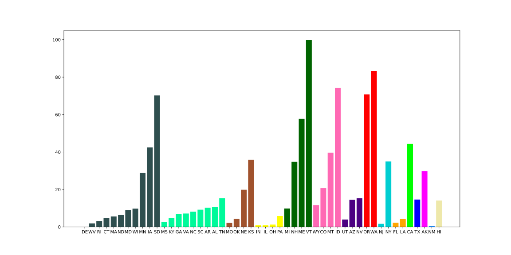
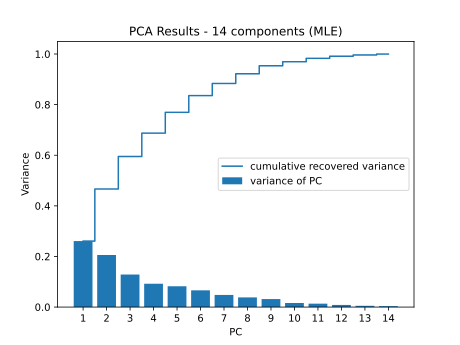

# Unsupervised learning
Using unsupervised learning, we aim to answer the questions:
- Are states with similar (absolute and/or relative) renewable energy production similar in other features?
- Which features most strongly impact renewable energy production in states?
- Are states with low renewable energy production less green because they are fettered by geographical limitations?

## K-means clustering
### Latest data (2016)
Running preliminary k-means on the most data of the most recent year that we have (2016) and analysing the distortion, we get the result:

From this graph, we pick k = 15 to cluster the data of the states in 2016 without renewable energy production. We plot the clusters together with the states' renewable energy percentage. States which are in the same cluster have the same color.

We can draw some observations from this graph:
- While there are definite clusters which have similar renewable energy percentage, most clusters have a very large variance
in its renewable energy percentage.
- Oregon and Washington are similar both geographically and in their renewable energy percentage.
- Alaska, Hawaii, New Mexico, California and Texas are uniquely in their own clusters.
- New York and New Jersey are in their own cluster.

The variance of renewable energy percentage within some clusters are encouraging because it implies that similar states can have wide-ranging renewable energy percentage. Thus, we can infer that this difference can be attributed to different policies pertaining to the energy industry or some other factors that are unrelated to the geographical factors that we have included in our dataset.

### All years (1998-2016)
Running preliminary k-means on the entire range of data we have (1998-2016) and analysing the distortion, we get the result:

We also pick k = 15 to cluster the data which is similar to the clustering we've done on data for the year 2016. This makes sense because the nature of the data hasn't changed, we've just included a wider range of it. However, because of the inclusion of multiple years of the same state, we can no longer represent the clusters as a histogram as we did for that of 2016.

The clustering can be represented in tabular form with the columns as the clusters and rows as the states, and each value in the table is the number of times each state's data for a particular year is in that cluster:

This visualization shows us the raw clustering and the spread of the states between clusters. For a deeper analysis considering the renewable energy production percentage of each state, we convert it to this graph representation:

States which are always clustered together for all 19 years are put in the same node, with the color of the node representing the mean renewable energy percentage within that cluster. Green clusters have a higher mean renewable energy production percentage. For states which had different years clustered to multiple different clusters, we use the edges' weights to represent how often the state is assigned to that cluster.

We observe the following:
- A lot of clusters are simply softer versions of the clusters in the data for 2016. For example:
    + Arkansas, Alabama, Georgia, Mississippi, North Carolina, South Carolina, Tennessee are in the same cluster.
    + Alaska, Hawaii, New Mexico, California and Texas are still in their own clusters.
    + Oregon and Washington are still isolated in their own cluster.
- However, the softer clustering is encouraging for renewable energy development. The fact that states which are predominantly clustered with low renewable percentage states are also sometimes clustered with high renewable percentage states means that in some years the features of that state where closer to that of states with high renewable production.

This clustering gives us justification that it is possible to transition a state (change it's non-geographical features) to achieve a higher renewable energy production.

## Gaussian Mixture Model (GMM)

Our implementation of GMM allowed us to compare if softer clustering works better than Kmeans:

From this image of the clusters, we observe some unexpected results. Compared to the Kmeans result:
- A lot of the clusters kept the same core states:
    + States with high percentage of renewable energy like OR/WA or VT/ME/NH
    + Several of the individual states were added to the existing clusters
- The notable individual states also kept their independence like CA/TX/AK.
- However, many of the states with little correlation like FL and NY were somehow clustered together.

We can tell that the results were not very optimal, and the GMM implementation seems to be less promising compared to the Kmeans results.

From here, we can also look at the AIC (Akaike information criterion) vs the BIC (Bayesian information criterion) scores that tell us the optimal number of components.

As we can see from the graphing, the scores both hit a minimum around n_components = 31, which is way more components than the 15 we used for clustering. This difference in expectations may result in the relatively poor clustering that we got from GMM. 

## Principal Component Analysis (PCA)

After centering and scaling our data, we performed PCA to try to reduce the number of dimensions of our dataset as we wanted to see if there were any features that can be excluded. The number of components selected is based on the MLE of the transformation, and the results are as follows:

We were unsuccessful in reducing the dimension of our dataset, as the number of components decreased by only 1 from 15 to 14. This shows that each feature can be considered important in representing the dataset and the bar graph of the first three components of PCA corroborates with this result:

As can be seen, there is a fairly decent spread of feature magnitudes among the first three components of PCA. Each feature we have chosen probably contributes a good amount of information to our dataset.

The following interactive plot of each state's annual data on the first three principal components show rather distinct clusters of states with high renewable energy production:



